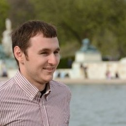

Ph.D. student 
<a href="http://bu.edu">Boston University</a> 
<a href="http://bu.edu/earth">Department of Earth & Environment </a> 
<a href="http://people.bu.edu/dietze">Ecological Forecasting Lab</a> 

  

# Short introduction

I am a Ph.D. Geography student at the Boston University Department of Earth & Environment, advised by Michael Dietze. 
Broadly, our lab is interested in "Ecological Forecasting" -- trying to predict how ecosystems will respond to human and natural changes in the future based on our understanding of them now and in the past. 
Our work towards this goal seeks to combine multiple data sources -- including field measurements, satellite imagery, and automated sensor networks -- with process-based computer models of plant and ecosystem function.

My role in our group involves the development and application of methods to work with airborne and satellite imagery. 
These methods primary involve "radiative transfer models", which link plant properties such as leaf pigment concentration and canopy structure to optical signatures. 
Inversion of these models allows us to estimate these properties from measurements of plant optics, which are usually easy to collect and are non-destructive.

